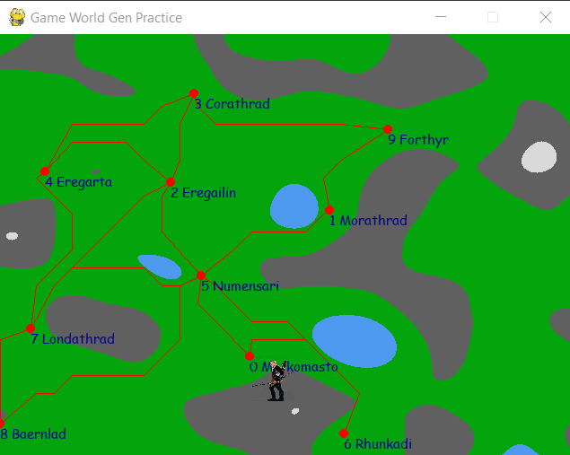

# Abstract

This project is a video game that implements various AI concepts. The player is tasked with travelling from their start city to their destination city. However, the player only has a limited amount of money to use as travel expenses which are used whenever the player travels between cities. Furthermore, there is a random chance the player may encounter a robber when travelling. If this happens, there is a game of rock paper scissors to determine if the robber is successful in taking money from the player.

The player wins if they make it to the destination.
The player loses if they run out of money.

To run the final version, run [src/final_game/agent_engironment.py](src/final_game/agent_environment.py).

# List of AI components in the project 

- Procedural Generation
- Genetic Algorithm
- Path Planning
- Graph Exploration
- Reflex Agent

# Problems Solved

## Procedural Generation

    Perlin noise is used to generate mountains and valleys in the map. The elevation is also used to create a cost map. This cost map is used to determine how expensive it is to travel a certain route.

## Genetic Algortithm

    A genetic algorithm is used to generate the placement of cities. Its hard to code an algorithm that can explictly place cities, however it's easier to define a fitness function that describes if a set of cities has a good distribution.

## Path Planning

    A-Star is used to find the best path between two cities. This makes for natural looking paths that curve around mountains. It also finds the cost to travel between cities.

## Graph Exploration (Additional Technique)

    Exploring graphs is used to determine what cities should be connected.

    The routes between cities is explored to ensure that the entire graph map is connected. This not exactly Dijkstra, but was inspired by it. This is a final step to ensure it's possible to complete the game. (The only time this fails is when the final city is located in water or snow peak. Which is a failure of GA)

    The routes are explored again to find the two cities that are farthest apart. This ensures that the game can't be completed in 1 or two turns.

## Reflex Agent

    A reflex agent is used as the robber opponent whenever the player faces combat.
